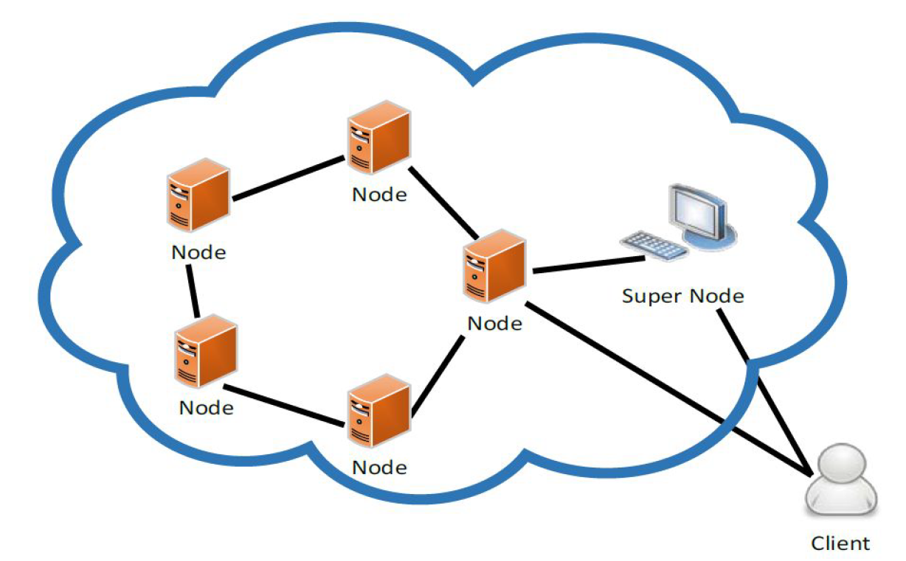

# DHT-Chord
#### Distributed Hash Table using the Chord Protocol for storing books and their respective mappings

## ABOUT

Using Thrift RPC and Java, this is an implementation of a Distributed Hash Table based on the [Chord - A scalable peer-to-peer protocol](https://pdos.csail.mit.edu/papers/chord:sigcomm01/chord_sigcomm.pdf)
for storing Books and their respective Genres. SuperNode is responsbile to regulate the Nodes joining the DHT and acts as a primary contact for any
Client Node seeking to set a book-genre mapping to the DHT or to get a mapping from it.

The DHT is configured and built with the Nodes coming online and adding themselves to
the DHT in succession, followed by which the Client can start using this DHT for storing and retrieving mappings.

## CONFIGURATION

The [Java Properties File](gen-java/config.txt) stores values which are needed to dynamically configure the system and specifies the following:
* First line mentions the number of bits (set to 5 initially, spans 0-31). Limitation of int: bits can not be more than 32 (spans 0 to 2^32-1).
* Second line mentions the IP port number of SuperNode. (eg: localhost 9099) which is separated by a single space

## SAMPLE DATA

Sample data has been provided in a [file](gen-java/shakespeares.txt).

## INSTRUCTIONS

There is a makefile provided that can be used to easily build and run the project.
*YOU NEED JAVA 1.8+ AND THRIFT 0.9+ TO RUN THIS SYSTEM*

To run the code, follow the steps:
(Everything needs to be run from the directory in which the files are present)
* Compile the project using:
  javac -cp ".:/usr/local/Thrift/*" *.java -d .
* Run the SuperNode using the following command
  java -cp ".:/usr/local/Thrift/*" SuperNode
* Run each Node of the DHT, for eg:
  java -cp ".:/usr/local/Thrift/*" Node localhost 8080
  java -cp ".:/usr/local/Thrift/*" Node localhost 9085
  java -cp ".:/usr/local/Thrift/*" Node localhost 9095
  (Note: We pass two parameters, one ip and other port in the command line )
* Next, we then run the Client on the local node to set the book details using:
  java -cp ".:/usr/local/Thrift/*" Client set shakespeares.txt
  (Note: We pass two parameters, one set and other the <fileName> which has the book details,   separated by a space)
* Next, we run the Client on the local node to get the book genre using:
  java -cp ".:/usr/local/Thrift/*" Client get Venus and Adonis
  (Note: We pass two parameters, one get and other the <bookName>)

